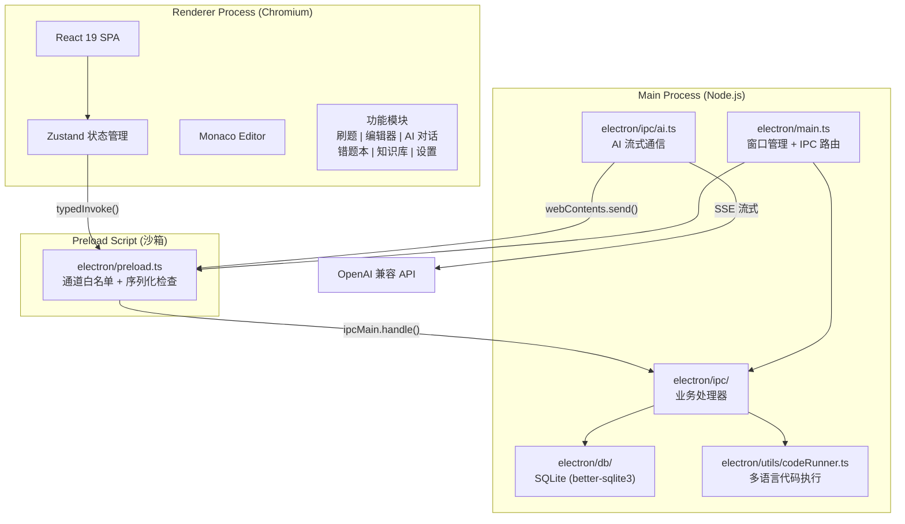

<p align="center">
  
</p>

<h1 align="center">CodeHelper</h1>

<p align="center">
  <a href="https://github.com/TIANWEN-cpu/CodeHelper/actions/workflows/ci.yml"></a>
  <a href="https://github.com/TIANWEN-cpu/CodeHelper/releases"></a>
  <a href="LICENSE"></a>
</p>

<p align="center">
  <strong>AI 驱动的桌面编程助手</strong>
</p>

<p align="center">
  基于 Electron + React + TypeScript 构建的一体化编程学习与开发工具
</p>

<p align="center">
  集成代码编辑器、AI 对话、题库系统、知识库检索与错题追踪，助力高效编程学习
</p>

---

## 功能特性

### Monaco 代码编辑器

VSCode 同款编辑引擎，提供专业级编码体验：

- 语法高亮与智能代码补全
- 多标签页管理，支持同时编辑多个文件
- 代码折叠、括号匹配、自动缩进
- 内置控制台（Console）面板，实时查看运行输出

<!--  -->

### AI 智能对话

支持 OpenAI 兼容 API 的 AI 编程助手：

- 流式输出，逐字符渲染，实时反馈
- Markdown 渲染与代码块语法高亮
- 预设提示词系统（内置 + 自定义）
- 长期记忆系统，跨对话记住用户偏好
- 支持任意 OpenAI 兼容服务（GPT-4o、本地 Ollama 等）

<!--  -->

### 题库系统

内置 158+ 道编程题目，一站式刷题平台：

- 多来源覆盖：力扣、牛客、PAT、CSP、数学建模
- 自动判题引擎，逐用例运行与比较
- 支持 Python、C、C++、C#、Java、SQL 六种语言
- 多维度筛选：难度、标签、来源、赛道、平台
- AI 侧边栏辅助解题

<!--  -->

### 知识库 RAG 检索

本地文档检索与知识管理：

- 支持 PDF / Markdown / TXT 文档导入（单文件最大 10MB）
- 自动文本分块（约 500 字符/块）
- 关键词匹配检索，按相关度排序
- 向量嵌入字段已预留，支持未来升级为语义检索

### 错题本

自动追踪错题，针对性强化薄弱环节：

- 从失败提交中自动收集错题
- 追踪错误次数与错误类型（编译错误、运行时错误、答案错误、超时）
- 支持 AI 分析薄弱知识点
- 记录正确代码，支持一键重做

### 代码运行器

支持六种编程语言的本地代码执行：

- Python、C、C++、C#、JavaScript 原生执行
- SQL 使用内存数据库执行与结果格式化
- 编译与运行阶段分离，精确错误定位
- 资源限制保护：10 秒超时、1MB 输出上限、最大 5 并发

### 个性化设置

- 主题切换：Catppuccin Mocha / Fjord / Ember 三套配色
- AI 模型配置：多模型管理，API Key 加密存储
- 编辑器自定义：字体大小、Tab 宽度
- 智能粘贴功能

## 截图预览

<!-- 将截图放入 docs/ 目录，然后取消注释以下行 -->
<!-- 示例：
<p align="center">
  
  
  
</p>
-->

> 将截图保存至 `docs/` 目录并更新上方引用即可展示

## 快速开始

> 适用于希望在 3 分钟内启动项目的开发者。完整安装说明见下方[安装与运行](#安装与运行)。

```bash
# 1. 克隆并进入项目
git clone https://github.com/TIANWEN-cpu/CodeHelper.git
cd CodeHelper

# 2. 安装依赖
npm install

# 3. 启动开发模式（自动打开 Electron 窗口）
npm run dev
```

启动后即可体验代码编辑器、题库系统、错题本和知识库等离线功能。如需使用 AI 对话功能，请在**设置**页面配置 API Key 和 Base URL。

> **Tip:** 未安装 Python / GCC 等编译器不会影响其他功能，仅代码运行器会提示"找不到命令"。

**常用开发命令速查：**

| 命令                | 用途                     |
| ------------------- | ------------------------ |
| `npm run dev`       | 启动开发服务器（热重载） |
| `npm run build`     | 构建生产版本             |
| `npm run build:win` | 构建 Windows 安装包      |
| `npm test`          | 运行单元测试             |
| `npm run lint`      | ESLint 代码检查          |
| `npm run typecheck` | TypeScript 类型检查      |

更多命令参见 [CONTRIBUTING.md - 开发工作流](CONTRIBUTING.md#开发工作流)。

## 安装与运行

### 环境要求

- Node.js >= 18
- npm >= 9
- Windows / macOS / Linux

### 开发模式

```bash
# 克隆仓库
git clone https://github.com/TIANWEN-cpu/CodeHelper.git
cd CodeHelper

# 安装依赖
npm install

# 启动开发服务器
npm run dev
```

### 开发环境配置

除 Node.js 外，代码运行器功能需要以下编译器/运行时：

| 语言       | 依赖                     | 安装说明                                                                      |
| ---------- | ------------------------ | ----------------------------------------------------------------------------- |
| Python     | `python` (>= 3.8)        | [python.org](https://www.python.org/downloads/) 或系统包管理器                |
| C / C++    | `gcc` / `g++`            | Windows: MinGW-w64; macOS: `xcode-select --install`; Linux: `build-essential` |
| Java       | `javac` / `java` (>= 11) | [Adoptium](https://adoptium.net/)                                             |
| C#         | `dotnet` (>= 6)          | [dotnet.microsoft.com](https://dotnet.microsoft.com/download)                 |
| JavaScript | `node`                   | 已随 Node.js 安装                                                             |

> 未安装对应编译器的语言仍可正常使用其他功能，仅代码运行器会提示找不到命令。

### 构建打包

```bash
# 构建应用
npm run build

# 打包为 Windows 安装包
npm run build:win
```

打包产物位置：

| 文件                                       | 说明        |
| ------------------------------------------ | ----------- |
| `dist-release/CodeHelper Setup 1.0.0.exe`  | NSIS 安装包 |
| `dist-release/win-unpacked/CodeHelper.exe` | 免安装版    |

## 技术栈

| 类别       | 技术                        |
| ---------- | --------------------------- |
| 桌面框架   | Electron 41                 |
| 前端框架   | React 19 + TypeScript 6     |
| 构建工具   | Vite 8 + electron-vite      |
| 状态管理   | Zustand 5                   |
| 代码编辑器 | Monaco Editor 0.55          |
| 样式方案   | TailwindCSS 4               |
| 数据库     | better-sqlite3 (SQLite)     |
| 图标库     | Lucide React                |
| 文档渲染   | react-markdown + remark-gfm |

## 项目结构

```
codehelper/
├── electron/                    # Electron 主进程
│   ├── main.ts                  # 应用入口
│   ├── preload.ts               # 预加载脚本
│   ├── ipc/                     # IPC 处理器
│   │   ├── runner.ts            # 代码执行引擎
│   │   ├── database.ts          # 数据库操作 + AI 配置
│   │   ├── ai.ts                # AI 对话（流式响应）
│   │   ├── problems.ts          # 题库管理 + 自动判题
│   │   ├── mistakes.ts          # 错题本管理
│   │   ├── rag.ts               # 知识库 RAG 引擎
│   │   └── chat.ts              # 聊天会话 + 预设提示词
│   ├── utils/                   # 纯函数工具模块
│   │   ├── codeRunner.ts        # 代码运行器（进程管理）
│   │   ├── sqlUtils.ts          # SQL 分割与判断
│   │   ├── textUtils.ts         # RAG 文本分块与正则转义
│   │   └── problemMeta.ts       # 题目元数据推断
│   └── db/
│       ├── index.ts             # 数据库连接
│       └── schema.sql           # 建表语句（10 张表）
├── src/                         # React 渲染进程
│   ├── App.tsx                  # 应用根组件
│   ├── main.tsx                 # 渲染进程入口
│   ├── components/              # 通用组件
│   │   ├── Sidebar.tsx          # 左侧图标导航栏
│   │   ├── Layout.tsx           # 主布局容器
│   │   ├── StatusBar.tsx        # 底部状态栏
│   │   └── ErrorBoundary.tsx    # 错误边界
│   ├── modules/                 # 功能模块
│   │   ├── editor/              # Monaco 编辑器
│   │   ├── problems/            # 刷题系统 + AI 侧边栏
│   │   ├── ai-chat/             # AI 助手对话
│   │   ├── mistakes/            # 错题本
│   │   ├── knowledge/           # 知识库
│   │   └── settings/            # 设置面板
│   ├── stores/                  # Zustand 状态管理
│   │   ├── appStore.ts          # 全局状态
│   │   ├── editorStore.ts       # 编辑器状态
│   │   ├── problemStore.ts      # 刷题状态
│   │   ├── chatStore.ts         # 聊天状态
│   │   └── settingsStore.ts     # 设置状态
│   └── utils/
│       └── labels.ts            # 标签映射纯函数
├── tests/                       # 单元测试
│   ├── labels.test.ts           # 标签函数测试
│   ├── sqlUtils.test.ts         # SQL 工具测试
│   ├── problemMeta.test.ts      # 题目元数据测试
│   └── textUtils.test.ts        # 文本工具测试
├── resources/
│   ├── problems/                # 题库数据文件
│   │   ├── basic.json           # 基础题 48 道
│   │   ├── leetcode.json        # 力扣经典题 80 道
│   │   └── math-modeling.json   # 数学建模题 30 道
│   └── icons/                   # 应用图标
├── electron-builder.yml         # 打包配置
├── electron.vite.config.ts      # Vite 构建配置
├── vitest.config.ts             # Vitest 测试配置
├── eslint.config.mjs            # ESLint flat config
├── .prettierrc.json             # Prettier 格式配置
├── package.json
└── tsconfig.json
```

## 系统架构



### 数据流概览

```
用户操作 -> React 组件 -> Zustand Store -> typedInvoke(channel, args)
    -> preload (白名单 + 序列化校验) -> IPC handler (参数校验 + 业务逻辑)
    -> SQLite / 子进程 / HTTP 请求
    -> 返回结果 -> 更新 Store -> UI 刷新
```

## 数据库设计

SQLite 数据库共 11 张表：

| 表名               | 用途         |
| ------------------ | ------------ |
| `problems`         | 题目信息     |
| `submissions`      | 代码提交记录 |
| `mistakes`         | 错题记录     |
| `ai_configs`       | AI 模型配置  |
| `chat_sessions`    | 聊天会话     |
| `chat_history`     | 聊天消息历史 |
| `prompt_presets`   | 预设提示词   |
| `knowledge_docs`   | 知识库文档   |
| `knowledge_chunks` | 文档分块向量 |
| `memories`         | 长期记忆     |
| `settings`         | 用户设置     |

## 安全特性

CodeHelper 在安全性方面采取了多项加固措施：

- **Chromium 渲染进程沙箱** -- 启用 `contextIsolation` 与 `nodeIntegration: false`，隔离渲染进程与 Node.js 环境
- **API 密钥加密存储** -- 使用 Electron `safeStorage` API 对敏感配置进行加密
- **CSP 内容安全策略** -- 配置严格的 Content-Security-Policy 头部，防止 XSS 攻击
- **代码执行资源限制** -- 超时控制、输出大小限制、并发数限制，防止资源耗尽
- **IPC 参数验证** -- 所有 IPC 调用进行类型检查与协议白名单校验
- **移除 `shell:true`** -- 子进程执行不使用 shell 模式，防止命令注入
- **外部链接协议白名单** -- 仅允许 `http:` 和 `https:` 协议的外部链接打开

## 配色方案

默认采用 **Catppuccin Mocha** 主题：

| 用途     | 颜色值           |
| -------- | ---------------- |
| 主背景   | `#1e1e2e`        |
| 侧边栏   | `#181825`        |
| 强调色   | `#cba6f7` (紫色) |
| 正文     | `#cdd6f4`        |
| 次要文字 | `#6c7086`        |
| 成功     | `#a6e3a1`        |
| 警告     | `#f9e2af`        |
| 错误     | `#f38ba8`        |
| 信息     | `#89b4fa`        |

## 测试

项目使用 [Vitest](https://vitest.dev/) 进行单元测试，覆盖核心纯函数模块。

```bash
# 运行所有测试（单次）
npm run test

# 监听模式（开发时自动重跑）
npm run test:watch

# 可视化测试界面
npm run test:ui
```

测试文件位于 `tests/` 目录：

| 测试文件              | 覆盖模块                                               |
| --------------------- | ------------------------------------------------------ |
| `labels.test.ts`      | 标签映射函数 (`src/utils/labels.ts`)                   |
| `sqlUtils.test.ts`    | SQL 分割与判断 (`electron/utils/sqlUtils.ts`)          |
| `problemMeta.test.ts` | 题目元数据推断 (`electron/utils/problemMeta.ts`)       |
| `textUtils.test.ts`   | RAG 文本分块与正则转义 (`electron/utils/textUtils.ts`) |

## 代码规范

项目使用 ESLint + Prettier 进行代码质量与格式管理。

```bash
# 检查代码规范
npm run lint

# 自动修复规范问题
npm run lint:fix

# 格式化代码
npm run format

# 检查格式（CI 用）
npm run format:check

# 类型检查
npm run typecheck
```

## 贡献指南

欢迎提交 Issue 和 Pull Request！详细的贡献指南请参阅 [CONTRIBUTING.md](CONTRIBUTING.md)，其中包含：

- 开发环境搭建与快速开始
- 项目架构概览（三进程模型、数据流）
- 调试技巧（Main 进程、Renderer DevTools、IPC 日志）
- 新增功能的步骤指南
- 分支与 Commit 规范
- 常见问题 FAQ

## 常见问题

### Q: `npm install` 报错 `better-sqlite3` 编译失败

`better-sqlite3` 是原生模块，需要编译工具链：

- **Windows**: 安装 [Visual Studio Build Tools](https://visualstudio.microsoft.com/visual-cpp-build-tools/)，选择"使用 C++ 的桌面开发"工作负载
- **macOS**: `xcode-select --install`
- **Linux**: `sudo apt install build-essential python3`

### Q: 代码运行器提示"找不到命令"

确保对应语言的编译器/运行时已安装并添加到系统 PATH 中。详细要求参见[开发环境配置](#开发环境配置)。

### Q: Electron 窗口白屏

1. 检查终端是否有编译错误
2. 尝试删除 `node_modules` 和 `out` 目录后重新安装：`rm -rf node_modules out && npm install`
3. 确认 Node.js 版本 >= 18

### Q: AI 对话无法使用

1. 在设置页面确认已添加 AI 配置（API Key 和 Base URL）
2. 检查 API 服务是否可访问（部分服务可能需要代理）
3. 确认 API Key 有效且账户有足够额度

### Q: 如何使用本地 AI 模型（如 Ollama）？

在设置中添加 AI 配置时，将 Base URL 设为本地服务地址（例如 `http://localhost:11434/v1`），Model 设为已下载的模型名称即可。

## 故障排除

### 安装阶段

| 问题                      | 解决方案                                                                        |
| ------------------------- | ------------------------------------------------------------------------------- |
| `npm install` 超时        | 尝试使用国内镜像：`npm config set registry https://registry.npmmirror.com`      |
| `better-sqlite3` 编译失败 | 安装 C++ 编译工具链（见上方 FAQ）                                               |
| `electron` 下载失败       | 设置镜像：`ELECTRON_MIRROR=https://npmmirror.com/mirrors/electron/ npm install` |

### 开发阶段

| 问题                     | 解决方案                                                                           |
| ------------------------ | ---------------------------------------------------------------------------------- |
| 热重载不生效             | 检查终端是否有编译错误，尝试重启 `npm run dev`                                     |
| IPC 调用失败             | 打开 DevTools (Ctrl+Shift+I) 查看控制台错误，检查通道名是否在白名单中              |
| Monaco 编辑器加载缓慢    | 首次加载需下载语言包，后续会缓存                                                   |
| 类型检查通过但运行时报错 | 检查 `src/types/ipc.ts` 中 `IpcChannelMap` 的类型定义是否与 IPC handler 返回值一致 |

### 构建打包阶段

| 问题                        | 解决方案                                       |
| --------------------------- | ---------------------------------------------- |
| `electron-builder` 打包失败 | 确保 `out/` 目录存在（先运行 `npm run build`） |
| 安装包无法运行              | 检查是否被杀毒软件误拦截，添加白名单           |

## 详细文档

| 文档                                                             | 说明                                         |
| ---------------------------------------------------------------- | -------------------------------------------- |
| [CONTRIBUTING.md](CONTRIBUTING.md)                               | 贡献指南（开发环境、分支策略、PR 流程）      |
| [FAQ.md](FAQ.md)                                                 | 常见问题与解答                               |
| [CHANGELOG.md](CHANGELOG.md)                                     | 版本更新日志                                 |
| [docs/architecture.md](docs/architecture.md)                     | 系统架构详解（进程模型、IPC 通信、安全模型） |
| [docs/api.md](docs/api.md)                                       | API 参考（IPC 通道、数据库 Schema、AI 集成） |
| [docs/faq.md](docs/faq.md)                                       | 详细 FAQ（按模块分类，含开发相关问答）       |
| [docs/changelog-extended.md](docs/changelog-extended.md)         | 详细版本历史（按模块分类的变更记录）         |
| [docs/reference/ipc-channels.md](docs/reference/ipc-channels.md) | IPC 通道完整参考                             |
| [docs/reference/stores.md](docs/reference/stores.md)             | Zustand Store 完整参考                       |
| [docs/reference/utils.md](docs/reference/utils.md)               | 工具函数完整参考                             |
| [docs/troubleshooting.md](docs/troubleshooting.md)               | 故障排除指南                                 |
| [docs/README.md](docs/README.md)                                 | 文档中心 -- 完整文档导航                     |
| [docs/quickstart.md](docs/quickstart.md)                         | 5 分钟快速入门                               |
| [docs/glossary.md](docs/glossary.md)                             | 术语表 -- 技术名词解释                       |
| [docs/search-index.md](docs/search-index.md)                     | 文档搜索索引                                 |

## See Also

- **快速上手**: [docs/quickstart.md](docs/quickstart.md) -- 从安装到完成第一道题
- **架构设计**: [docs/architecture.md](docs/architecture.md) -- 深入了解三进程模型与数据流
- **API 参考**: [docs/api.md](docs/api.md) -- IPC 通道、数据库 Schema 与 AI 集成
- **故障排除**: [docs/troubleshooting.md](docs/troubleshooting.md) -- 常见问题与解决方案
- **术语表**: [docs/glossary.md](docs/glossary.md) -- 技术术语速查
- **贡献指南**: [CONTRIBUTING.md](CONTRIBUTING.md) -- 参与开发的完整流程

## 许可证

本项目基于 [MIT License](LICENSE) 开源。

---

<p align="center">
  <sub>Built with Electron + React + TypeScript</sub>
</p>
