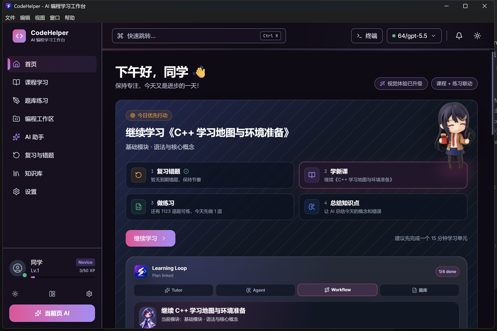
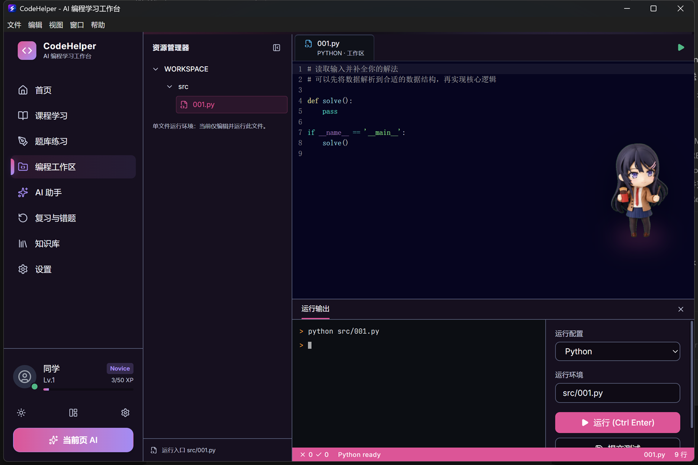
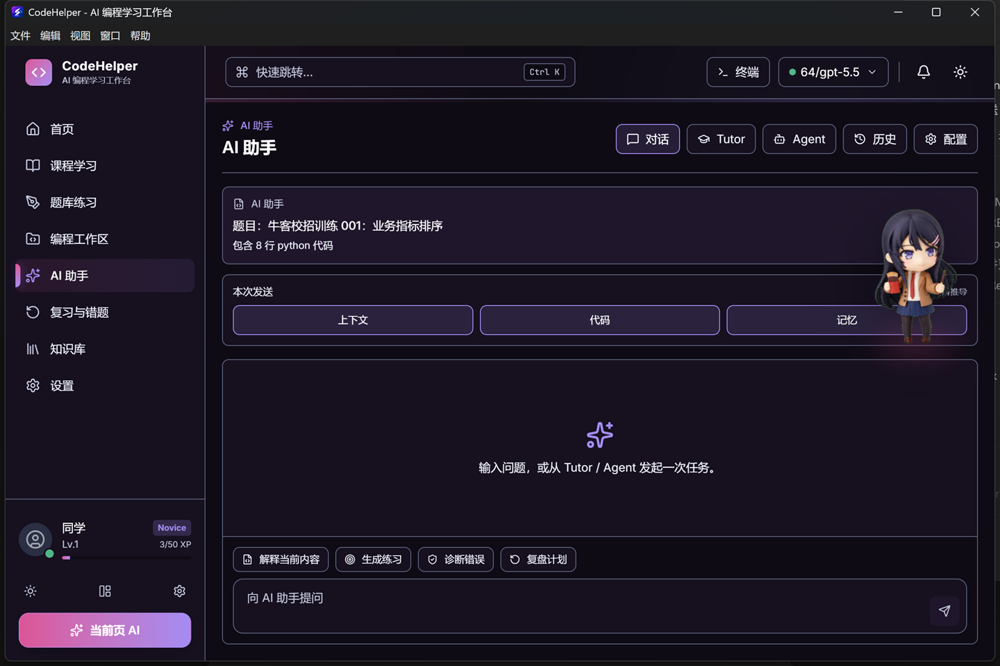
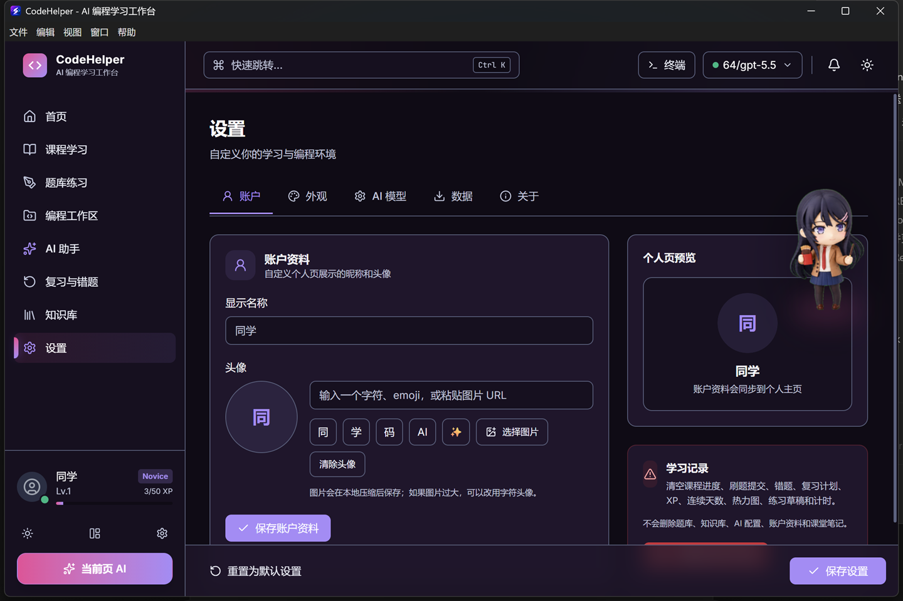

<p align="center">
  
</p>

<h1 align="center">CodeHelper Studio</h1>

<p align="center">
  AI 驱动的一体化桌面编程学习平台。<br>
  代码编辑、AI 辅导、刷题训练、课程练习、知识库检索、错题复盘和学习记录集中在一个窗口里。
</p>

<p align="center">
  <a href="https://github.com/TIANWEN-cpu/CodeHelper-Studio/actions/workflows/ci.yml"></a>
  <a href="https://github.com/TIANWEN-cpu/CodeHelper-Studio/releases"></a>
  <a href="LICENSE"></a>
  
  
  
</p>

<p align="center">
  <a href="#当前版本">当前版本</a> &bull;
  <a href="#截图预览">截图预览</a> &bull;
  <a href="#核心能力">核心能力</a> &bull;
  <a href="#快速开始">快速开始</a> &bull;
  <a href="#打包与发布">打包与发布</a> &bull;
  <a href="https://github.com/TIANWEN-cpu/CodeHelper-Studio/releases/latest">下载最新版</a>
</p>

## 当前版本

**v2.2.1 - 2026-06-06**

这一版聚焦真实桌面使用体验：浅色主题重新打磨，账户设置支持自定义头像和昵称，学习记录支持一键清空，AI 桌宠和主题套装命名进一步整理，并补齐资源包导入链路与回归测试。

发布页：[CodeHelper Studio Releases](https://github.com/TIANWEN-cpu/CodeHelper-Studio/releases)

## 截图预览

<p align="center">
  <table>
    <tr>
      <td align="center">
        <br>
        <b>首页学习工作台</b><br>
        <sub>学习计划、课程入口、复盘节奏和桌宠陪伴集中展示。</sub>
      </td>
      <td align="center">
        <br>
        <b>编程工作区</b><br>
        <sub>代码编辑、资源管理、运行输出和运行配置在同一工作台完成。</sub>
      </td>
    </tr>
    <tr>
      <td align="center">
        <br>
        <b>AI 助手</b><br>
        <sub>带入当前题目、代码和记忆上下文，支持 Tutor / Agent / 对话模式。</sub>
      </td>
      <td align="center">
        <br>
        <b>设置与账户</b><br>
        <sub>自定义昵称与头像，学习记录可清空且保留题库、知识库和 AI 配置。</sub>
      </td>
    </tr>
  </table>
</p>

## 适合谁用

- 正在系统学习编程、算法、C/C++、Python、数据库或软件工程的学生。
- 希望把刷题、复盘、笔记、AI 提问放在同一个桌面环境里的学习者。
- 想要一个本地优先、可配置 AI Provider、数据可迁移的编程练习工作台。
- 需要 Electron + React + SQLite 项目样板和 IPC 实践参考的开发者。

## 核心能力

### 编程工作台

- CodeMirror 6 编辑器，支持 Python、C/C++、JavaScript、SQL 等语言高亮。
- 本地代码运行器，统一显示 stdout、stderr、退出码和运行耗时。
- 工作区、底部面板和 AI 侧栏联动，报错后可以直接交给 AI 辅助分析。

### AI 辅导

- 支持 OpenAI 兼容 API 与本地 Ollama 等 Provider。
- 对话支持 Markdown、代码块、历史会话、预设提示词和长期记忆。
- 可自动带入当前题目、练习、错题、代码和报错上下文。

### 刷题与课程练习

- 内置多来源题库，覆盖算法、复试、建模、IC 岗位、基础练习等方向。
- 题目筛选、详情、提交判题、提交历史和 AI 提示形成闭环。
- 结构化课程内容覆盖 C、C++、C#、Python、数据库、Web 和集成主题。

### 错题与复盘

- 失败提交可进入错题系统。
- 复习队列支持间隔复习和掌握度反馈。
- 首页学习数据、活动记录、成就进度和错题趋势来自真实本地数据。

### 知识库

- 支持本地文档上传、分块存储、关键词检索、语义检索入口和 RAG 上下文注入。
- 适合保存课程笔记、题解、常见错误、项目资料和个人知识片段。

### 个性化设置

- 深色、浅色、高对比、紧凑布局和主题套装。
- 账户资料可自定义昵称、图片头像、URL 头像或文本头像。
- 学习记录可一键清空，同时保留题库、知识库、AI 配置、账户资料和课堂笔记。

## v2.2.1 更新重点

- 浅色主题不再复用深色大块，首页工作台与个人主页横幅改成浅色专属视觉。
- 修复白色主题下文字、按钮和透明文本对比度不足的问题。
- 设置页新增账户模式，可自定义头像和名字。
- 学习记录新增一键清空能力。
- AI 桌宠低动效模式减少闲置动画，个人页自动缩小停靠。
- 主题套装命名更协调，移除无效主题图片入口。
- 新增资源包导入 IPC 与前端服务封装。

完整变更见 [CHANGELOG.md](CHANGELOG.md)，发布说明见 [RELEASE.md](RELEASE.md)。

## 快速开始

### 环境要求

- Node.js 20 或更高版本
- npm 10 或更高版本
- Windows 10/11（官方安装包）
- macOS / Linux 可从源码运行，暂不作为当前正式安装包目标

代码运行器会调用本机语言环境。未安装 Python、GCC、Node.js 等运行时不会影响应用启动，只会影响对应语言的运行功能。

### 本地开发

```bash
npm install
npm run dev
```

### 常用命令

```bash
npm run typecheck
npm run test
npm run build
npm run package:win:dir
```

| 命令                      | 说明                               |
| ------------------------- | ---------------------------------- |
| `npm run dev`             | 启动 Electron + Vite 开发环境      |
| `npm run build`           | 构建主进程、预加载脚本和渲染端     |
| `npm run typecheck`       | 运行 TypeScript 项目检查           |
| `npm run test`            | 运行 Vitest 测试                   |
| `npm run test:coverage`   | 运行覆盖率测试                     |
| `npm run package:win:dir` | 构建 Windows unpacked 包并校验资源 |
| `npm run build:win`       | 构建 Windows 安装包                |
| `npm run build:mac`       | 本地尝试构建 macOS 包              |
| `npm run build:linux`     | 本地尝试构建 Linux 包              |

## 项目结构

```text
.
├── electron/              # Electron 主进程、preload、IPC、SQLite 和运行器
│   ├── db/                # better-sqlite3 schema 与迁移
│   ├── ipc/               # AI、题库、课程、知识库、学习记录等 IPC
│   └── utils/             # 代码运行、安全、文本、SQL、性能工具
├── src/                   # React 渲染端
│   ├── modules/           # 首页、工作台、AI、题库、复习、知识库、设置
│   ├── stores/            # Zustand 状态
│   ├── api/               # 类型化 IPC 调用封装
│   └── components/        # 通用 UI 组件
├── content/               # 结构化课程内容
├── resources/             # 图标、题库、知识素材、演示数据
├── tests/                 # 单元、IPC、集成和回归测试
├── docs/                  # 架构、数据流、IPC、可访问性和开发文档
└── .github/workflows/     # CI 与 Release 自动化
```

## 数据与隐私

- 默认数据存放在本机 Electron 用户数据目录。
- SQLite 保存题库进度、提交记录、错题、知识库、设置、账户资料和 AI 配置。
- AI Provider 由用户自行配置，API Key 存在本地配置中。
- 学习记录清空只删除学习活动相关数据，不删除题库、知识库、AI 配置、账户资料和课堂笔记。

## AI Provider 配置

在设置页添加 OpenAI 兼容服务即可使用 AI 对话与上下文辅导。常见字段：

- Base URL，例如 `https://api.openai.com/v1`
- API Key
- Model，例如 `gpt-4.1-mini`、`gpt-4o-mini` 或兼容服务提供的模型名
- Temperature / Max Tokens 等生成参数

本地 Ollama 或其他兼容服务也可以通过相同方式接入。

## 打包与发布

Release 工作流由 `.github/workflows/release.yml` 驱动：

- 标签 `v*` 推送后触发发布流程。
- 当前正式 Release 只发布 Windows 安装包和自动更新清单。
- macOS / Linux 暂不上传官方安装包，避免把未充分验证的平台产物交给用户。
- GitHub Release 由 workflow 的发布阶段统一创建，Electron Builder 打包阶段不会提前发布。

本地发版前建议至少运行：

```bash
npm run typecheck
npx vitest run tests/productionFixes.test.ts tests/learningRecordsIpc.test.ts
npm run build
```

## 文档入口

- [docs/architecture.md](docs/architecture.md) - 总体架构
- [docs/api.md](docs/api.md) - IPC 与数据接口
- [docs/concepts/data-flow.md](docs/concepts/data-flow.md) - 前后端数据流
- [docs/concepts/ipc-patterns.md](docs/concepts/ipc-patterns.md) - IPC 开发规范
- [docs/data-portability.md](docs/data-portability.md) - 数据导入导出
- [docs/accessibility.md](docs/accessibility.md) - 可访问性检查

## 贡献

欢迎提交 issue、改进文档、补充题库、修复 UI 细节或扩展测试。开发前建议先阅读 [CONTRIBUTING.md](CONTRIBUTING.md) 与 `docs/concepts` 下的架构说明。

提交前建议运行：

```bash
npm run typecheck
npm run test
npm run build
```

## License

MIT License. See [LICENSE](LICENSE).
