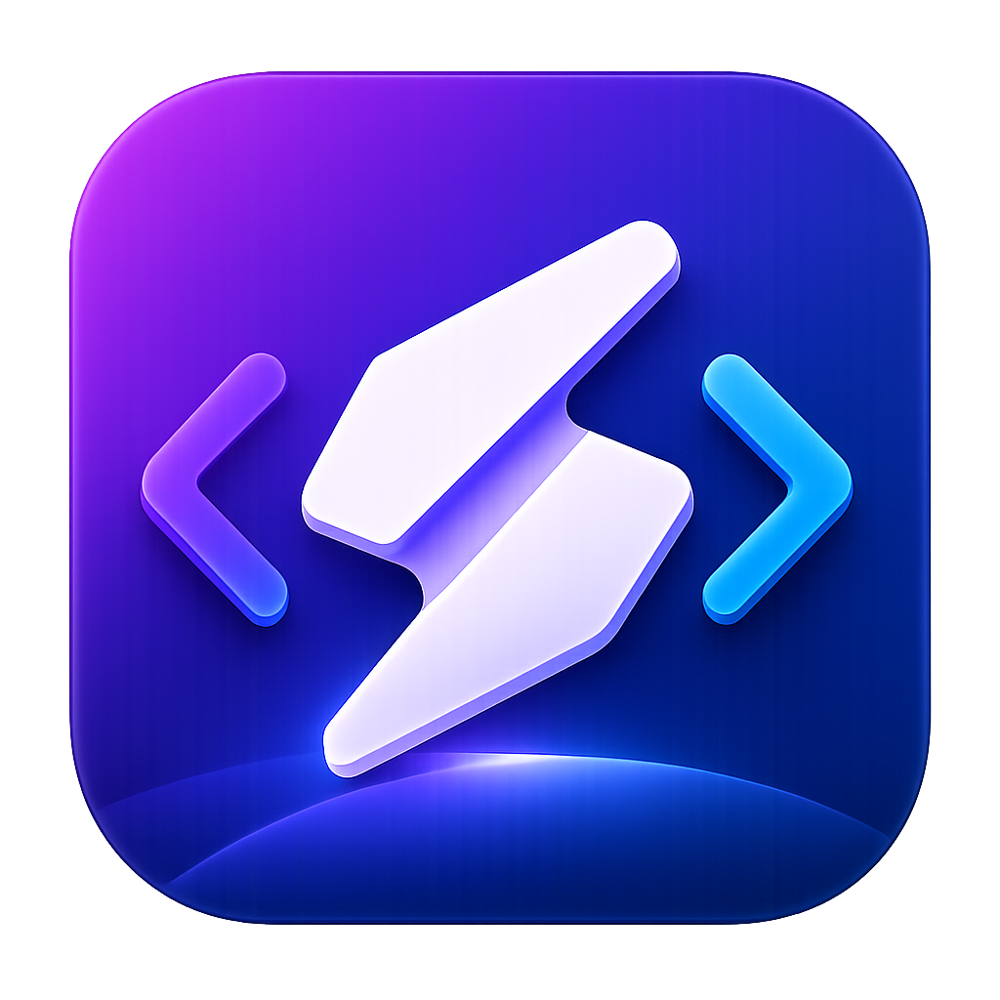
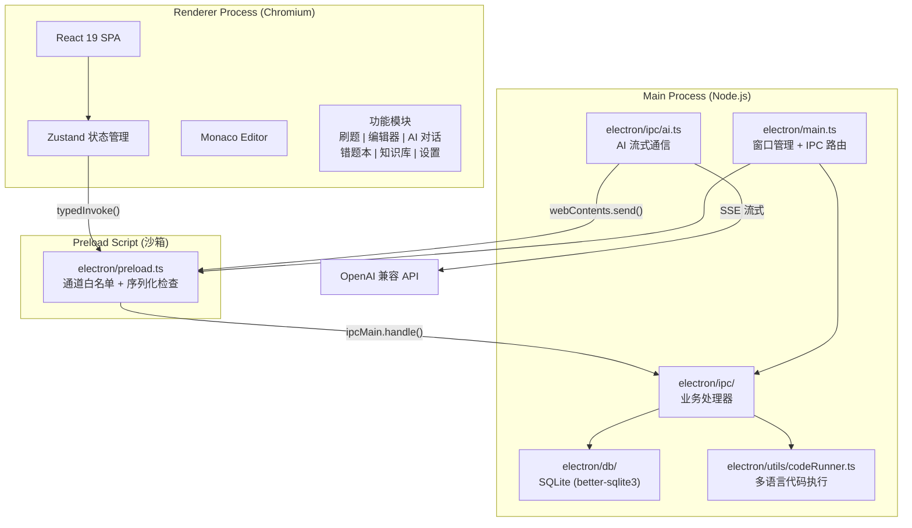

<p align="center">
  
</p>

<h1 align="center">CodeHelper</h1>

<p align="center">
  <a href="https://github.com/TIANWEN-cpu/CodeHelper/actions/workflows/ci.yml"></a>
  <a href="https://github.com/TIANWEN-cpu/CodeHelper/releases"></a>
  <a href="LICENSE"></a>
  <a href="tests/"></a>
  <a href="tests/"></a>
  <a href="https://github.com/TIANWEN-cpu/CodeHelper/stargazers"></a>
</p>

<h3 align="center">AI 驱动的一体化桌面编程学习平台</h3>

<p align="center">
  集代码编辑、AI 对话、智能刷题、知识库检索与错题追踪于一身。<br>
  一个应用，覆盖编程学习的全部场景。<br>
  <strong>写代码、问 AI、刷题、查资料 -- 全在一个窗口里完成。</strong>
</p>

<p align="center">
  <a href="#-快速开始">快速开始</a> &bull;
  <a href="#-功能亮点">功能亮点</a> &bull;
  <a href="#-截图预览">截图预览</a> &bull;
  <a href="#-为什么选择-codehelper">为什么选择 CodeHelper</a> &bull;
  <a href="docs/quickstart.md">详细文档</a>
</p>

---

## 为什么选择 CodeHelper？

编程学习者的日常是这样的：在 VSCode 里写代码、在浏览器里问 ChatGPT、在力扣上刷题、在笔记软件里记知识点 -- 四五个窗口来回切换，上下文不断丢失。

**CodeHelper 把这一切合并到一个桌面应用中。** 你不需要在工具之间跳转，不需要重复配置环境，不需要在不同平台之间复制粘贴代码。

|             传统工作流             |        CodeHelper        |
| :--------------------------------: | :----------------------: |
| VSCode + ChatGPT + 力扣 + 笔记软件 |     **一个窗口搞定**     |
|     手动复制粘贴代码和错误信息     |  **AI 侧边栏直接分析**   |
|          错题分散在各平台          |  **自动收集，一键重做**  |
|          知识点散落在各处          | **本地知识库，即时检索** |

---

## 功能亮点

### :pencil2: Monaco 代码编辑器

> VSCode 同款编辑引擎，开箱即用的专业级编码体验

- 语法高亮与智能代码补全
- 多标签页管理，同时编辑多个文件
- 代码折叠、括号匹配、自动缩进
- 内置控制台面板，实时查看运行输出

### :robot: AI 智能对话

> 支持任意 OpenAI 兼容 API，你的编程 AI 助手

- 流式输出，逐字符渲染，实时反馈
- Markdown 渲染与代码块语法高亮
- 预设提示词系统（内置 + 自定义）
- 长期记忆系统，跨对话记住你的偏好
- 支持 GPT-4o、本地 Ollama 等任意兼容服务

### :dart: 题库系统

> 内置 158+ 道编程题目，一站式刷题平台

- 多来源覆盖：力扣、牛客、PAT、CSP、数学建模
- 自动判题引擎，逐用例运行与精确比较
- 支持 Python、C、C++、C#、Java、SQL 六种语言
- 多维度筛选：难度、标签、来源、赛道、平台
- AI 侧边栏实时辅助解题

### :books: 知识库 RAG 检索

> 本地文档管理与智能检索

- 支持 PDF / Markdown / TXT 文档导入（单文件最大 10MB）
- 自动文本分块，关键词匹配检索，按相关度排序
- 向量嵌入字段已预留，支持未来升级为语义检索

### :warning: 错题本

> 自动追踪错误，针对性强化薄弱环节

- 从失败提交中自动收集错题
- 追踪错误次数与错误类型（编译错误、运行时错误、答案错误、超时）
- AI 分析薄弱知识点，记录正确代码，支持一键重做

### :zap: 代码运行器

> 六种语言本地执行，编译与运行分离

- Python、C、C++、C#、JavaScript 原生执行
- SQL 使用内存数据库执行与结果格式化
- 资源限制保护：10 秒超时、1MB 输出上限、最大 5 并发

### :art: 个性化设置

> 三套主题配色，打造你的专属编码环境

- Catppuccin Mocha / Fjord / Ember 主题切换
- 多模型管理，API Key 加密存储
- 编辑器字体大小、Tab 宽度自定义
- 智能粘贴功能

---

## 截图预览

<!-- 将截图放入 docs/ 目录，然后取消注释以下行 -->

<p align="center">
  <table>
    <tr>
      <td align="center">
        <br>
        <b>Monaco 代码编辑器</b><br>
        <sub>VSCode 同款引擎，语法高亮 + 智能补全</sub>
      </td>
      <td align="center">
        <br>
        <b>AI 智能对话</b><br>
        <sub>流式输出，Markdown 渲染，预设提示词</sub>
      </td>
    </tr>
    <tr>
      <td align="center">
        <br>
        <b>题库系统</b><br>
        <sub>158+ 题目，自动判题，AI 辅助</sub>
      </td>
      <td align="center">
        <br>
        <b>错题本</b><br>
        <sub>自动收集，错误追踪，一键重做</sub>
      </td>
    </tr>
  </table>
</p>

<!-- > 将截图保存至 `docs/` 目录并更新上方引用即可展示 -->

---

## 为什么选择 CodeHelper？

<p align="center">
  <em>"不再需要在五个工具之间来回切换"</em>
</p>

<!-- 占位：收集真实用户评价后替换 -->

<table>
  <tr>
    <td>
      <blockquote>
        <p>"CodeHelper 让我的刷题效率提升了一倍。AI 侧边栏直接分析代码，不用再手动复制到 ChatGPT。"</p>
        <footer>-- beta 用户 A</footer>
      </blockquote>
    </td>
    <td>
      <blockquote>
        <p>"终于有一个工具把编辑器和题库整合在一起了。错题本功能特别实用，自动收集失败的提交。"</p>
        <footer>-- beta 用户 B</footer>
      </blockquote>
    </td>
  </tr>
  <tr>
    <td>
      <blockquote>
        <p>"知识库 RAG 功能让我可以随时检索课程笔记，不用再翻文件夹了。"</p>
        <footer>-- beta 用户 C</footer>
      </blockquote>
    </td>
    <td>
      <blockquote>
        <p>"支持本地 Ollama 模型是最大的亮点，离线也能用 AI 辅助编程。"</p>
        <footer>-- beta 用户 D</footer>
      </blockquote>
    </td>
  </tr>
</table>

---

## CodeHelper vs 竞品

| 特性         |      CodeHelper      |   Cursor   | VSCode + Copilot |  LeetCode  |  ChatGPT   |
| :----------- | :------------------: | :--------: | :--------------: | :--------: | :--------: |
| 代码编辑器   | Monaco (VSCode 同款) | 自有编辑器 |      VSCode      | 简易编辑器 |     无     |
| AI 对话      |      多模型支持      |  内置模型  |  GitHub Copilot  |     无     |  GPT 系列  |
| 内置题库     |     158+ 多来源      |     无     |        无        |     有     |     无     |
| 自动判题     |      逐用例判题      |     无     |        无        |     有     |     无     |
| 错题追踪     |       自动收集       |     无     |        无        |    手动    |     无     |
| 知识库 RAG   |     本地文档检索     |     无     |        无        |     无     | 有（云端） |
| 本地 AI 支持 |      Ollama 等       |     无     |        无        |     无     |     无     |
| 离线使用     |     核心功能可用     |   需联网   |       部分       |   需联网   |   需联网   |
| 开源免费     |     MIT License      |    付费    |     部分免费     | 免费/付费  |    付费    |
| 数据隐私     |       本地存储       |    云端    |       云端       |    云端    |    云端    |

> 详细对比参见 [docs/comparison.md](docs/comparison.md)

---

## 快速开始

> **3 分钟，从零到运行。**

```bash
# 1. 克隆并进入项目
git clone https://github.com/TIANWEN-cpu/CodeHelper.git
cd CodeHelper

# 2. 安装依赖
npm install

# 3. 启动开发模式
npm run dev
```

启动后即可体验代码编辑器、题库系统、错题本和知识库等离线功能。如需使用 AI 对话功能，请在 **设置** 页面配置 API Key 和 Base URL。

> **Tip:** 未安装 Python / GCC 等编译器不会影响其他功能，仅代码运行器会提示"找不到命令"。

**常用开发命令：**

| 命令                | 用途                     |
| :------------------ | :----------------------- |
| `npm run dev`       | 启动开发服务器（热重载） |
| `npm run build`     | 构建生产版本             |
| `npm run build:win` | 构建 Windows 安装包      |
| `npm test`          | 运行单元测试             |
| `npm run lint`      | ESLint 代码检查          |
| `npm run typecheck` | TypeScript 类型检查      |

---

## 安装与运行

### 环境要求

- Node.js >= 18
- npm >= 9
- Windows / macOS / Linux

### 开发环境配置

代码运行器功能需要以下编译器/运行时（未安装不影响其他功能）：

| 语言       | 依赖                     | 安装说明                                                                      |
| :--------- | :----------------------- | :---------------------------------------------------------------------------- |
| Python     | `python` (>= 3.8)        | [python.org](https://www.python.org/downloads/)                               |
| C / C++    | `gcc` / `g++`            | Windows: MinGW-w64; macOS: `xcode-select --install`; Linux: `build-essential` |
| Java       | `javac` / `java` (>= 11) | [Adoptium](https://adoptium.net/)                                             |
| C#         | `dotnet` (>= 6)          | [dotnet.microsoft.com](https://dotnet.microsoft.com/download)                 |
| JavaScript | `node`                   | 已随 Node.js 安装                                                             |

### 构建打包

```bash
npm run build          # 构建应用
npm run build:win      # 打包 Windows 安装包
```

打包产物：

| 文件                                       | 说明        |
| :----------------------------------------- | :---------- |
| `dist-release/CodeHelper Setup 1.1.0.exe`  | NSIS 安装包 |
| `dist-release/win-unpacked/CodeHelper.exe` | 免安装版    |

---

## 技术栈

| 类别       | 技术                        |
| :--------- | :-------------------------- |
| 桌面框架   | Electron 41                 |
| 前端框架   | React 19 + TypeScript 6     |
| 构建工具   | Vite 7 + electron-vite 5    |
| 状态管理   | Zustand 5                   |
| 代码编辑器 | Monaco Editor 0.55          |
| 样式方案   | TailwindCSS 4               |
| 数据库     | better-sqlite3 (SQLite)     |
| 图标库     | Lucide React                |
| 文档渲染   | react-markdown + remark-gfm |

---

## 项目结构

```
codehelper/
├── electron/                    # Electron 主进程
│   ├── main.ts                  # 应用入口
│   ├── preload.ts               # 预加载脚本
│   ├── ipc/                     # IPC 处理器
│   │   ├── runner.ts            # 代码执行引擎
│   │   ├── database.ts          # 数据库操作 + AI 配置
│   │   ├── ai.ts                # AI 对话（流式响应）
│   │   ├── problems.ts          # 题库管理 + 自动判题
│   │   ├── mistakes.ts          # 错题本管理
│   │   ├── rag.ts               # 知识库 RAG 引擎
│   │   └── chat.ts              # 聊天会话 + 预设提示词
│   ├── utils/                   # 纯函数工具模块
│   └── db/                      # SQLite 数据库（11 张表）
├── src/                         # React 渲染进程
│   ├── components/              # 通用组件
│   ├── modules/                 # 功能模块
│   │   ├── editor/              # Monaco 编辑器
│   │   ├── problems/            # 刷题系统 + AI 侧边栏
│   │   ├── ai-chat/             # AI 助手对话
│   │   ├── mistakes/            # 错题本
│   │   ├── knowledge/           # 知识库
│   │   └── settings/            # 设置面板
│   └── stores/                  # Zustand 状态管理
├── tests/                       # 单元测试
├── resources/                   # 题库数据 + 应用图标
└── docs/                        # 文档
```

---

## 系统架构



---

## 安全特性

- **Chromium 渲染进程沙箱** -- `contextIsolation` + `nodeIntegration: false`
- **API 密钥加密存储** -- Electron `safeStorage` API
- **CSP 内容安全策略** -- 严格 Content-Security-Policy 头部
- **代码执行资源限制** -- 超时 / 输出大小 / 并发数三重保护
- **IPC 参数验证** -- 类型检查 + 协议白名单校验
- **无 shell 注入** -- 子进程执行不使用 `shell:true`
- **外部链接白名单** -- 仅允许 `http:` / `https:` 协议

---

## 测试

```bash
npm run test          # 运行所有测试
npm run test:watch    # 监听模式
npm run test:ui       # 可视化测试界面
```

---

## 代码规范

```bash
npm run lint          # 检查代码规范
npm run lint:fix      # 自动修复
npm run format        # 格式化代码
npm run typecheck     # TypeScript 类型检查
```

---

## 贡献指南

欢迎提交 Issue 和 Pull Request！详细的贡献指南请参阅 [CONTRIBUTING.md](CONTRIBUTING.md)，其中包含：

- 开发环境搭建与快速开始
- 项目架构概览（三进程模型、数据流）
- 调试技巧（Main 进程、Renderer DevTools、IPC 日志）
- 新增功能的步骤指南
- 分支与 Commit 规范
- 常见问题 FAQ

**贡献者入门路径：**

1. 阅读 [CONTRIBUTING.md](CONTRIBUTING.md) 了解开发流程
2. 浏览 [Good First Issues](https://github.com/TIANWEN-cpu/CodeHelper/labels/good%20first%20issue) 寻找适合入门的任务
3. Fork 项目，创建功能分支，提交 PR
4. 等待 Code Review，合并后成为 CodeHelper 贡献者

---

## 常见问题

### Q: `npm install` 报错 `better-sqlite3` 编译失败

`better-sqlite3` 是原生模块，需要编译工具链：

- **Windows**: 安装 [Visual Studio Build Tools](https://visualstudio.microsoft.com/visual-cpp-build-tools/)，选择"使用 C++ 的桌面开发"工作负载
- **macOS**: `xcode-select --install`
- **Linux**: `sudo apt install build-essential python3`

### Q: 代码运行器提示"找不到命令"

确保对应语言的编译器/运行时已安装并添加到系统 PATH 中。详细要求参见[开发环境配置](#开发环境配置)。

### Q: Electron 窗口白屏

1. 检查终端是否有编译错误
2. 尝试删除 `node_modules` 和 `out` 目录后重新安装：`rm -rf node_modules out && npm install`
3. 确认 Node.js 版本 >= 18

### Q: AI 对话无法使用

1. 在设置页面确认已添加 AI 配置（API Key 和 Base URL）
2. 检查 API 服务是否可访问（部分服务可能需要代理）
3. 确认 API Key 有效且账户有足够额度

### Q: 如何使用本地 AI 模型（如 Ollama）？

在设置中添加 AI 配置时，将 Base URL 设为本地服务地址（例如 `http://localhost:11434/v1`），Model 设为已下载的模型名称即可。

---

## 故障排除

### 安装阶段

| 问题                      | 解决方案                                                                        |
| :------------------------ | :------------------------------------------------------------------------------ |
| `npm install` 超时        | 尝试使用国内镜像：`npm config set registry https://registry.npmmirror.com`      |
| `better-sqlite3` 编译失败 | 安装 C++ 编译工具链（见上方 FAQ）                                               |
| `electron` 下载失败       | 设置镜像：`ELECTRON_MIRROR=https://npmmirror.com/mirrors/electron/ npm install` |

### 开发阶段

| 问题                  | 解决方案                                       |
| :-------------------- | :--------------------------------------------- |
| 热重载不生效          | 检查终端是否有编译错误，尝试重启 `npm run dev` |
| IPC 调用失败          | 打开 DevTools (Ctrl+Shift+I) 查看控制台错误    |
| Monaco 编辑器加载缓慢 | 首次加载需下载语言包，后续会缓存               |

---

## 详细文档

| 文档                                                   | 说明                                    |
| :----------------------------------------------------- | :-------------------------------------- |
| [CONTRIBUTING.md](CONTRIBUTING.md)                     | 贡献指南（开发环境、分支策略、PR 流程） |
| [FAQ.md](FAQ.md)                                       | 常见问题与解答                          |
| [CHANGELOG.md](CHANGELOG.md)                           | 版本更新日志                            |
| [docs/architecture.md](docs/architecture.md)           | 系统架构详解                            |
| [docs/api.md](docs/api.md)                             | API 参考                                |
| [docs/quickstart.md](docs/quickstart.md)               | 5 分钟快速入门                          |
| [docs/features-showcase.md](docs/features-showcase.md) | 功能详细展示                            |
| [docs/comparison.md](docs/comparison.md)               | 竞品对比分析                            |
| [docs/troubleshooting.md](docs/troubleshooting.md)     | 故障排除指南                            |
| [docs/README.md](docs/README.md)                       | 文档中心                                |

---

## 许可证

本项目基于 [MIT License](LICENSE) 开源 -- 免费使用，自由修改，商业友好。

---

<p align="center">
  <strong>CodeHelper -- 写代码、问 AI、刷题、查资料，一个窗口搞定。</strong><br><br>
  <a href="https://github.com/TIANWEN-cpu/CodeHelper/stargazers">:star: Star this repo</a> &bull;
  <a href="https://github.com/TIANWEN-cpu/CodeHelper/releases">:package: Download</a> &bull;
  <a href="https://github.com/TIANWEN-cpu/CodeHelper/issues">:bug: Report Issue</a> &bull;
  <a href="CONTRIBUTING.md">:handshake: Contribute</a><br><br>
  <sub>Built with Electron + React + TypeScript</sub>
</p>
