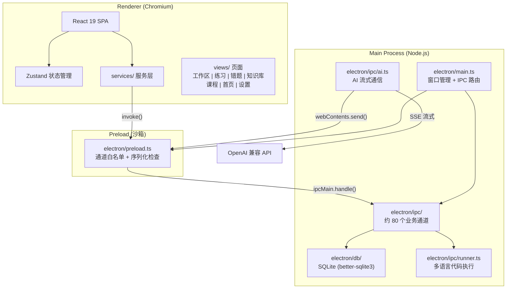

<p align="center">
  
</p>

<h1 align="center">CodeHelper</h1>

<p align="center">
  <a href="https://github.com/TIANWEN-cpu/CodeHelper-Studio/actions/workflows/ci.yml"></a>
  <a href="LICENSE"></a>
  
  
  
</p>

<h3 align="center">AI 驱动的一体化桌面编程学习平台</h3>

<p align="center">
  集代码编辑、AI 对话、智能刷题、课程练习、知识库检索与错题复习于一身。<br>
  一个应用，覆盖编程学习的全部场景。<br>
  <strong>写代码、问 AI、刷题、查资料、复盘错题 —— 全在一个窗口里完成。</strong>
</p>

<p align="center">
  <a href="#-功能亮点">功能亮点</a> &bull;
  <a href="#-快速开始">快速开始</a> &bull;
  <a href="#-技术栈">技术栈</a> &bull;
  <a href="#-项目结构">项目结构</a> &bull;
  <a href="docs/quickstart.md">详细文档</a>
</p>

---

## 关于本版本

CodeHelper 由三个项目融合而成的一体化产品：

- **现代化前端外壳** —— Electron + electron-vite + React 19 + TailwindCSS v4 打造的 UI 与交互层
- **CodeHelper 后端** —— 约 80 个 IPC 通道 + SQLite 持久化，承载代码运行、判题、AI、知识库、错题与统计
- **结构化学习内容** —— 算法、C/C++、Python、数据结构等数百篇课程练习作为内容源

经过四轮"假功能真实化"审查，前端不再有任何装饰性空壳：**每一个按钮、开关、统计都接通真实后端**。可扩展，不简化。

---

## 为什么选择 CodeHelper？

编程学习者的日常：在编辑器里写代码、在浏览器里问 AI、在题库平台刷题、在笔记软件记知识点 —— 多个窗口来回切换，上下文不断丢失。

**CodeHelper 把这一切合并到一个桌面应用中。** 无需在工具之间跳转，无需重复配置环境，无需跨平台复制粘贴代码。

|             传统工作流             |        CodeHelper        |
| :--------------------------------: | :----------------------: |
| 编辑器 + AI 网页 + 题库 + 笔记软件 |     **一个窗口搞定**     |
|     手动复制粘贴代码和错误信息     |  **AI 侧边栏直接分析**   |
|          错题分散在各平台          | **自动收集 + 间隔复习**  |
|          知识点散落在各处          | **本地知识库，即时检索** |

---

## 功能亮点

### :pencil2: CodeMirror 代码编辑器

> 基于 CodeMirror 6 的现代编辑体验，多语言语法高亮

- 多种代码主题实时切换（基于 thememirror）
- Python / C / C++ / SQL 等语言的语法高亮
- 行号、括号匹配、自动缩进
- 内置终端面板，实时查看运行输出与判题结果

### :robot: AI 智能对话

> 支持任意 OpenAI 兼容 API，上下文感知的编程助手

- 流式输出，逐字符渲染
- Markdown 渲染与代码块高亮（marked）
- 预设提示词系统（内置 + 自定义）
- **上下文感知**：提问自动带入当前题目 / 练习 / 错题的代码与报错
- **长期记忆 + 多会话**：跨对话记住偏好，多会话互不串扰
- **运行报错一键诊断**：把代码与 stderr 直接交给 AI 分析
- 支持 GPT 系列、本地 Ollama 等任意兼容服务

### :dart: 题库系统

> 内置多来源编程题目，一站式刷题平台

- 多来源覆盖：力扣、牛客、PAT、CSP、数学建模等
- 自动判题引擎，逐用例运行与精确比较
- 多维度筛选：难度、标签、来源、赛道、平台
- AI 侧边栏实时辅助解题

### :books: 课程练习

> 数百篇结构化学习内容，由浅入深

- 算法、数据结构、C/C++、Python 等主题课程
- 练习与工作区双向闭环：在工作区直接编写、运行、提交练习
- 提交结果（通过/失败、用例反馈、得分）真实回写

### :warning: 错题本 + 间隔复习

> 自动追踪错误，SM-2 算法科学复盘

- 从失败提交中自动收集错题，进入 SM-2 间隔复习队列
- **真实三档自评**（还不会 / 有点难 / 已掌握）驱动复习间隔
- AI 复盘建议：结合错误代码与参考答案给出根因分析（未配置 AI 时诚实回退本地规则）
- 错误类型、错误次数、知识点标签全程追踪

### :mag: 知识库 RAG 检索

> 本地文档管理与智能检索

- 支持 PDF / Markdown / TXT 文档导入
- 自动文本分块，关键词匹配检索，按相关度排序
- 向量嵌入字段已预留，支持未来升级为语义检索

### :bar_chart: 学习数据统计

> 行为埋点驱动，真实反映你的努力

- 代码运行、解题通过、课程完成、AI 提问等行为自动埋点
- 首页活跃度热力图（按周对齐）、连续学习天数、经验与等级
- 全部由真实操作事件推导，绝非装饰性占位

### :zap: 多语言代码运行器

> 本地执行，编译与运行分离

- Python、C、C++、C#、JavaScript（Node.js）原生执行
- SQL 使用内存数据库执行与结果格式化
- 资源限制保护：执行超时、输出上限、最大并发数

### :art: 真实个性化设置

> 每一个开关都真实生效

- 代码主题、应用主题色（全色系跟随）、浅色/深色切换
- 紧凑侧边栏、AI 面板、底部面板、双行标签等布局开关接通真实状态
- 日期区域格式与每周起始日真实影响日期显示与热力图对齐
- 多模型管理，API Key 加密存储

---

## 截图预览

<p align="center">
  <table>
    <tr>
      <td align="center">
        <br>
        <b>代码编辑器</b><br>
        <sub>CodeMirror 6，多语言高亮 + 多主题</sub>
      </td>
      <td align="center">
        <br>
        <b>AI 智能对话</b><br>
        <sub>上下文感知，流式输出，长期记忆</sub>
      </td>
    </tr>
    <tr>
      <td align="center">
        <br>
        <b>题库系统</b><br>
        <sub>多来源题目，自动判题，AI 辅助</sub>
      </td>
      <td align="center">
        <br>
        <b>错题本</b><br>
        <sub>自动收集，SM-2 间隔复习</sub>
      </td>
    </tr>
  </table>
</p>

---

## 快速开始

> **3 分钟，从零到运行。**

```bash
# 1. 克隆并进入项目
git clone https://github.com/TIANWEN-cpu/CodeHelper-Studio.git
cd CodeHelper-Studio

# 2. 安装依赖
npm install

# 3. 启动开发模式
npm run dev
```

启动后即可体验代码编辑器、题库系统、课程练习、错题本与知识库等离线功能。如需 AI 对话功能，请在 **设置** 页面配置 API Key 与 Base URL。

> **Tip:** 未安装 Python / GCC 等编译器不会影响其他功能，仅代码运行器会提示"找不到命令"。

**常用开发命令：**

| 命令                | 用途                     |
| :------------------ | :----------------------- |
| `npm run dev`       | 启动开发服务器（热重载） |
| `npm run build`     | 构建生产版本             |
| `npm run build:win` | 构建 Windows 安装包      |
| `npm test`          | 运行单元测试             |
| `npm run lint`      | ESLint 代码检查          |
| `npm run typecheck` | TypeScript 类型检查      |

---

## 安装与运行

### 环境要求

- Node.js >= 18
- npm >= 9
- Windows / macOS / Linux

### 代码运行器依赖（可选）

代码运行器功能需要以下编译器/运行时，未安装不影响其他功能：

| 语言       | 依赖              | 安装说明                                                                      |
| :--------- | :---------------- | :---------------------------------------------------------------------------- |
| Python     | `python` (>= 3.8) | [python.org](https://www.python.org/downloads/)                               |
| C / C++    | `gcc` / `g++`     | Windows: MinGW-w64; macOS: `xcode-select --install`; Linux: `build-essential` |
| C#         | `dotnet` (>= 6)   | [dotnet.microsoft.com](https://dotnet.microsoft.com/download)                 |
| JavaScript | `node`            | 已随 Node.js 安装                                                             |

### 构建打包

```bash
npm run build          # 构建应用
npm run build:win      # 打包 Windows 安装包
```

---

## 技术栈

| 类别       | 技术                                 |
| :--------- | :----------------------------------- |
| 桌面框架   | Electron 41                          |
| 前端框架   | React 19 + TypeScript 6              |
| 构建工具   | Vite 7 + electron-vite 5             |
| 状态管理   | Zustand 5                            |
| 代码编辑器 | CodeMirror 6 (@uiw/react-codemirror) |
| 样式方案   | TailwindCSS 4                        |
| 数据库     | better-sqlite3 (SQLite)              |
| 图表       | Recharts                             |
| 动画       | Motion                               |
| 文档渲染   | marked                               |
| 图标库     | Lucide React                         |

---

## 项目结构

```
codehelper/
├── electron/                    # Electron 主进程
│   ├── main.ts                  # 应用入口（启动链路 + 窗口管理）
│   ├── preload.ts               # 预加载脚本（通道白名单）
│   ├── ipc/                     # IPC 处理器（约 80 个通道）
│   │   ├── runner.ts            # 多语言代码执行引擎
│   │   ├── database.ts          # 数据库操作 + AI 配置
│   │   ├── ai.ts                # AI 对话（流式响应）
│   │   ├── chat.ts              # 会话历史 + 人设 + 长期记忆
│   │   ├── problems.ts          # 题库管理 + 自动判题
│   │   ├── exercises.ts         # 课程练习评测
│   │   ├── lessons.ts           # 课程内容
│   │   ├── mistakes.ts          # 错题本
│   │   ├── review.ts            # SM-2 间隔复习
│   │   ├── rag.ts               # 知识库 RAG 引擎
│   │   ├── analytics.ts         # 行为埋点与学习统计
│   │   ├── home.ts              # 首页概览
│   │   └── achievements.ts      # 成就系统
│   └── db/                      # SQLite schema 与连接
├── src/                         # React 渲染进程
│   ├── App.tsx                  # 根组件
│   ├── store.ts                 # Zustand 全局状态
│   ├── views/                   # 页面视图
│   │   ├── HomeView.tsx         # 首页（统计 / 热力图 / 待复习）
│   │   ├── WorkspaceView.tsx    # 代码工作区（CodeMirror）
│   │   ├── PracticeView.tsx     # 课程练习
│   │   ├── ReviewView.tsx       # 错题本 + 复习
│   │   ├── KnowledgeView.tsx    # 知识库
│   │   ├── LearnView.tsx        # 课程学习
│   │   ├── ProfileView.tsx      # 个人主页
│   │   └── SettingsView.tsx     # 设置
│   ├── services/                # 前端服务层（封装 IPC 调用）
│   ├── components/              # 通用组件（编辑器 / 布局 / AI 面板等）
│   ├── hooks/                   # 业务 hooks
│   └── lib/                     # 主题 / 区域 / 外观等工具
├── content/                     # 结构化课程练习内容
├── tests/                       # 单元测试
├── resources/                   # 题库数据 + 应用图标
└── docs/                        # 详细文档
```

---

## 系统架构



---

## 安全特性

- **Chromium 渲染进程沙箱** —— `contextIsolation` + `nodeIntegration: false`
- **API 密钥加密存储** —— Electron `safeStorage` API
- **CSP 内容安全策略** —— 严格 Content-Security-Policy
- **代码执行资源限制** —— 超时 / 输出大小 / 并发数三重保护
- **IPC 参数验证** —— 类型检查 + 协议白名单校验
- **无 shell 注入** —— 子进程执行不使用 `shell:true`
- **外部链接白名单** —— 仅允许 `http:` / `https:` 协议

---

## 测试

```bash
npm run test          # 运行所有测试
npm run test:watch    # 监听模式
npm run test:ui       # 可视化测试界面
npm run test:coverage # 覆盖率报告
```

---

## 代码规范

```bash
npm run lint          # ESLint 检查
npm run lint:fix      # 自动修复
npm run format        # Prettier 格式化
npm run typecheck     # TypeScript 类型检查
```

提交前由 husky + lint-staged 自动对暂存文件执行 ESLint 修复与 Prettier 格式化。

---

## 详细文档

| 文档                                                   | 说明         |
| :----------------------------------------------------- | :----------- |
| [docs/quickstart.md](docs/quickstart.md)               | 快速入门     |
| [docs/architecture.md](docs/architecture.md)           | 系统架构详解 |
| [docs/api.md](docs/api.md)                             | API 参考     |
| [docs/features-showcase.md](docs/features-showcase.md) | 功能详细展示 |
| [docs/troubleshooting.md](docs/troubleshooting.md)     | 故障排除指南 |
| [CONTRIBUTING.md](CONTRIBUTING.md)                     | 贡献指南     |
| [CHANGELOG.md](CHANGELOG.md)                           | 版本更新日志 |

---

## 许可证

本项目基于 [MIT License](LICENSE) 开源 —— 免费使用，自由修改，商业友好。

---

<p align="center">
  <strong>CodeHelper —— 写代码、问 AI、刷题、查资料、复盘错题，一个窗口搞定。</strong><br><br>
  <sub>Built with Electron + React + TypeScript</sub>
</p>
